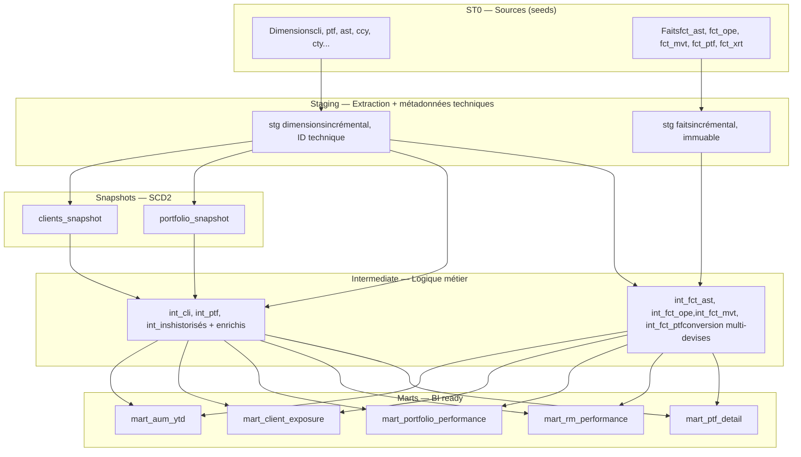

# Banking DBT Pipeline


Pipeline analytique de bout en bout pour institution financière de banque privée,
construit avec **dbt**, orchestré avec **Airflow**, et validé par **CI/CD**.

Ce projet reproduit l'architecture d'un Data Warehouse bancaire (inspiré des
systèmes core comme Avaloq) : ingestion de référentiels et de faits financiers,
historisation des dimensions, conversion multi-devises, et exposition de data marts
prêts pour le reporting BI (AUM, performance, exposition client, NNM).

## Points clés

- **Architecture en 4 couches** avec dépendance stricte descendante
  (`st0 → staging → intermediate → marts`)
- **Gestion multi-devises** : chaque montant est exposé en devise locale,
  en devise du portefeuille et en devise de référence banque (CHF),
  via jointures sur les taux de change datés (pivot CHF)
- **Historisation SCD2** des dimensions clients et portefeuilles (snapshots dbt)
- **Modèles incrémentaux** avec clés techniques séquentielles stables entre les runs
- **387 tests** de qualité de données (unicité, non-nullité, valeurs acceptées,
  intégrité référentielle)
- **CI/CD** GitHub Actions : build + test automatiques à chaque push
- **Orchestration** Airflow (Astronomer) avec ordonnancement respectant
  les dépendances inter-couches

## Architecture



### Les 4 couches

| Couche | Rôle | Matérialisation |
|--------|------|-----------------|
| **ST0** | Sources brutes (seeds CSV simulant l'extraction du core banking) | seed |
| **Staging** | Nettoyage, typage, ajout des métadonnées techniques (ID séquentiel, timestamp, source, PID d'exécution) | incrémental |
| **Intermediate** | Historisation SCD2, jointures dimensionnelles, conversion multi-devises | incrémental / vue |
| **Marts** | Agrégations métier prêtes pour la BI | table |

## Modèle de données

### Dimensions
Clients, portefeuilles, actifs, instruments, devises, pays, catégories client,
profils de risque, relationship managers (et leurs groupes), gestionnaires externes,
agents, entités juridiques, business units, types d'opérations.

### Faits
- **fct_ast** — positions d'actifs valorisées par date
- **fct_ope** — opérations financières (achats, ventes, versements, retraits)
- **fct_mvt** — mouvements titres et cash rattachés aux opérations
- **fct_ptf** — performance mensuelle des portefeuilles (AUM, P&L, NNM, flux YTD/MTD/DTD)
- **fct_xrt** — taux de change datés

### Gestion multi-devises

Un client dont la devise de référence est le CHF veut voir l'ensemble de ses
portefeuilles — quelle que soit leur devise locale — convertis en CHF.
Chaque montant financier est donc exposé sur plusieurs axes :

- **natif** — dans la devise de la position/opération
- **_ptf** — converti dans la devise du portefeuille (via pivot CHF)
- **_ref** — converti en CHF, devise de référence de la banque

Les conversions utilisent le taux de change **à la date du fait**, jamais un taux fixe.

## Stack technique

- **dbt-core** (transformation) — DuckDB en dev, Snowflake en cible production
- **Airflow** (Astronomer Runtime) — orchestration
- **GitHub Actions** — CI/CD
- **dbt packages** : dbt_utils, dbt_expectations

## Démarrage rapide

### Prérequis
- Python 3.9+
- dbt-core + dbt-duckdb (`pip install dbt-core dbt-duckdb`)

### Lancer le pipeline

```bash
# Installer les dépendances dbt
dbt deps

# Charger les données sources
dbt seed --full-refresh

# Construire les couches dans l'ordre
dbt run --select staging
dbt snapshot
dbt run --select intermediate
dbt run --select marts

# Lancer les tests
dbt test
```

Le profil DuckDB local (`~/.dbt/profiles.yml`) :

```yaml
banking_pipeline:
  target: dev
  outputs:
    dev:
      type: duckdb
      path: dev.duckdb
      threads: 4
```

## Orchestration

Le pipeline est orchestré par un DAG Airflow qui respecte l'ordre des couches.
Voir [`orchestration/airflow/`](orchestration/airflow/) pour le détail et
les instructions de lancement en local.
seed → run staging → snapshot → run intermediate → run marts → test

Planification : jours ouvrés à 23h, après clôture des marchés.

## CI/CD

Chaque push et pull request sur `main` déclenche automatiquement le pipeline
complet (seed → staging → snapshot → run → test) sur DuckDB via GitHub Actions.
Voir [`.github/workflows/dbt_ci.yml`](.github/workflows/dbt_ci.yml).

## Structure du projet
banking-dbt-pipeline/
├── models/
│   ├── staging/
│   │   ├── dimensions/       # stg des référentiels
│   │   └── faits/            # stg des tables de faits
│   ├── intermediate/         # SCD2, enrichissement, conversion devises
│   └── marts/                # data marts BI
├── seeds/                    # données sources (ST0)
├── snapshots/                # SCD2 clients et portefeuilles
├── tests/                    # tests singuliers
├── macros/                   # macros réutilisables
├── orchestration/airflow/    # DAG Airflow (Astronomer)
└── .github/workflows/        # CI/CD

## Auteur

**Jérémy Thouvenot** — Consultant Data & BI, spécialisé dans les institutions
financières de la région genevoise. Expertise en ETL/ELT, dbt, et reporting
pour la banque privée.