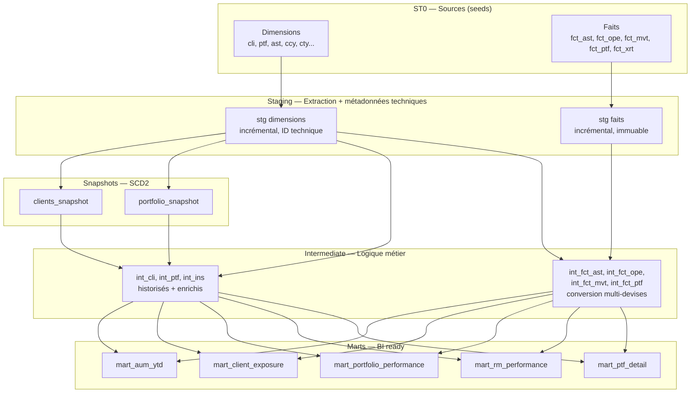

# Banking DBT Pipeline


📖 **[Documentation dbt en ligne](https://thouvenotjeremy.github.io/banking-dbt-pipeline/)** —
lineage complet (DAG cliquable) et description de chaque modèle/colonne,
régénérée à chaque push sur `main`.

Pipeline analytique de bout en bout pour institution financière de banque privée,
construit avec **dbt** (DuckDB en dev, **Snowflake** en cible production), orchestré
avec **Airflow**, et validé par **CI/CD** à chaque push. Le développement s'appuie
sur un workflow assisté par agent IA (Claude Code) cadré par des règles versionnées,
et le pipeline embarque de l'observability de données sur la conversion multi-devises.

## Développement assisté par agent (Claude Code)

Ce projet documente et versionne son usage d'un agent IA comme outil de
développement, au même titre que le reste de l'outillage :

- **[`CLAUDE.md`](CLAUDE.md)** — fichier de règles versionné, lu automatiquement
  par l'agent à chaque session : règle de dépendance stricte entre couches,
  nomenclature des préfixes/suffixes de colonnes, pattern exact des métadonnées
  techniques en staging (ID incrémental stable, timestamp, source, PID d'exécution).
  L'objectif : rendre les conventions du projet explicites et opposables plutôt
  qu'implicites, pour que le code généré reste reproductible d'une session et
  d'un contributeur à l'autre.
- **`/new-stg`** — slash command qui industrialise la création d'un modèle
  staging conforme au pattern du projet à partir d'une table source `st0_*`
  (dimension ou fait, métadonnées techniques, tests, mise à jour de
  `sources.yml`/`schema.yml`), pour éviter les erreurs de copier-coller sur
  un squelette répété ~20 fois dans le projet. Exemple : `/new-stg st0_pos_typ`.

Détail complet du workflow et de l'outillage : [`.claude/README.md`](.claude/README.md).

## Qualité & observability des données

**434 tests** dbt s'exécutent à chaque run CI, dont :

- **35 tests de cohérence de conversion multi-devises**, via 2 macros de test
  génériques réutilisables (`tests/generic/`) plutôt que du SQL dupliqué par
  colonne :
  - `currency_conversion_consistency` — vérifie que chaque montant `_ref`
    vaut bien `montant_natif × taux` (conversion directe vers CHF), à une
    tolérance d'arrondi de 0.01 près ;
  - `currency_pivot_conversion_consistency` — même garantie pour les montants
    `_ptf`, dont la formule diffère (pivot CHF à deux taux :
    `montant_natif × taux_source ÷ taux_portefeuille`).

  Appliqués sur les 4 modèles de faits de la couche intermediate
  (`int_fct_ptf`, `int_fct_ast`, `int_fct_ope`, `int_fct_mvt`), ces tests
  transforment une hypothèse de conversion en garantie vérifiée à chaque run —
  toute dérive silencieuse (jointure de taux erronée, taux périmé, régression
  de formule) fait échouer `dbt test` avant d'atteindre un mart ou un
  reporting client.
- **399 tests structurels** : unicité et non-nullité des clés techniques et
  codes métier, valeurs acceptées sur les colonnes à domaine fermé
  (ex: devises, catégories client), intégrité référentielle entre modèles.

## Architecture



### Les 4 couches

| Couche | Rôle | Matérialisation |
|--------|------|-----------------|
| **ST0** | Sources brutes (seeds CSV simulant l'extraction du core banking) | seed |
| **Staging** | Nettoyage, typage, ajout des métadonnées techniques (ID séquentiel, timestamp, source, PID d'exécution) | incrémental |
| **Intermediate** | Historisation SCD2, jointures dimensionnelles, conversion multi-devises | incrémental / vue |
| **Marts** | Agrégations métier prêtes pour la BI | table |

## Modèle de données

### Dimensions
Clients, portefeuilles, actifs, instruments, devises, pays, catégories client,
profils de risque, relationship managers (et leurs groupes), gestionnaires externes,
agents, entités juridiques, business units, types d'opérations, types de position.

### Faits
- **fct_ast** — positions d'actifs valorisées par date
- **fct_ope** — opérations financières (achats, ventes, versements, retraits)
- **fct_mvt** — mouvements titres et cash rattachés aux opérations
- **fct_ptf** — performance mensuelle des portefeuilles (AUM, P&L, NNM, flux YTD/MTD/DTD)
- **fct_xrt** — taux de change datés

### Gestion multi-devises

Un client dont la devise de référence est le CHF veut voir l'ensemble de ses
portefeuilles — quelle que soit leur devise locale — convertis en CHF.
Chaque montant financier est donc exposé sur plusieurs axes :

- **natif** — dans la devise de la position/opération
- **_ptf** — converti dans la devise du portefeuille (via pivot CHF)
- **_ref** — converti en CHF, devise de référence de la banque

Les conversions utilisent le taux de change **à la date du fait**, jamais un taux
fixe — et leur cohérence est vérifiée par les tests décrits ci-dessus.

## Stack technique

- **dbt-core** (transformation) — DuckDB en dev, Snowflake en cible production
- **Airflow** (Astronomer Runtime) — orchestration
- **GitHub Actions** — CI/CD
- **dbt packages** : dbt_utils, dbt_expectations

## Démarrage rapide

### Prérequis
- Python 3.9+
- dbt-core + dbt-duckdb (`pip install dbt-core dbt-duckdb`)

### Lancer le pipeline

```bash
# Installer les dépendances dbt
dbt deps

# Charger les données sources
dbt seed --full-refresh

# Construire les couches dans l'ordre
dbt run --select staging
dbt snapshot
dbt run --select intermediate
dbt run --select marts

# Lancer les tests
dbt test
```

Le profil DuckDB local (`~/.dbt/profiles.yml`) :

```yaml
banking_pipeline:
  target: dev
  outputs:
    dev:
      type: duckdb
      path: dev.duckdb
      threads: 4
```

## Orchestration

Le pipeline est orchestré par un DAG Airflow qui respecte l'ordre des couches.
Voir [`orchestration/airflow/`](orchestration/airflow/) pour le détail et
les instructions de lancement en local.

```
seed → run staging → snapshot → run intermediate → run marts → test
```

Planification : jours ouvrés à 23h, après clôture des marchés.

## CI/CD

Chaque push et pull request sur `main` déclenche automatiquement le pipeline
complet (seed → staging → snapshot → run → test) sur DuckDB via GitHub Actions.
Voir [`.github/workflows/dbt_ci.yml`](.github/workflows/dbt_ci.yml).

## Passage à l'échelle

Ce projet tourne sur un jeu de données de démonstration (quelques dizaines
de lignes par table de fait). [`docs/scaling.md`](docs/scaling.md) détaille,
avec le code réel de ce repo, où les choix actuels casseraient à un volume
de production bancaire (millions de positions, dizaines de milliers
d'opérations par jour) et quelles évolutions concrètes y répondraient :
stratégie incrémentale des faits, génération des ID de dimensions,
clustering Snowflake, borne du cross join calendrier × SCD2, orchestration
Airflow.

## Structure du projet
```
banking-dbt-pipeline/
├── .claude/                  # Configuration et workflow Claude Code
│   ├── commands/              # Slash commands (ex: /new-stg)
│   └── README.md               # Détail du workflow assisté par agent
├── models/
│   ├── staging/
│   │   ├── dimensions/       # stg des référentiels
│   │   └── faits/            # stg des tables de faits
│   ├── intermediate/         # SCD2, enrichissement, conversion devises
│   └── marts/                # data marts BI
├── seeds/                    # données sources (ST0)
├── snapshots/                # SCD2 clients et portefeuilles
├── tests/
│   ├── generic/               # macros de test réutilisables (ex: cohérence FX)
│   └── *.sql                  # tests singuliers
├── macros/                   # macros réutilisables
├── orchestration/airflow/    # DAG Airflow (Astronomer)
└── .github/workflows/        # CI/CD
```

---

## Auteur

**Jérémy Thouvenot** — Consultant Data & BI

5 ans d'expérience en banque privée suisse (Lombard Odier, CA Indosuez, Capital Union Bank, Hinduja Bank). Spécialisé dans les pipelines de données Avaloq/Azqore, Talend, Qlik Sense et Power BI, pour les institutions financières de la région genevoise.

[Profil Malt](https://www.malt.fr/profile/jeremythouvenot) ·
[LinkedIn](https://www.linkedin.com/in/jeremy-thouvenot/)
